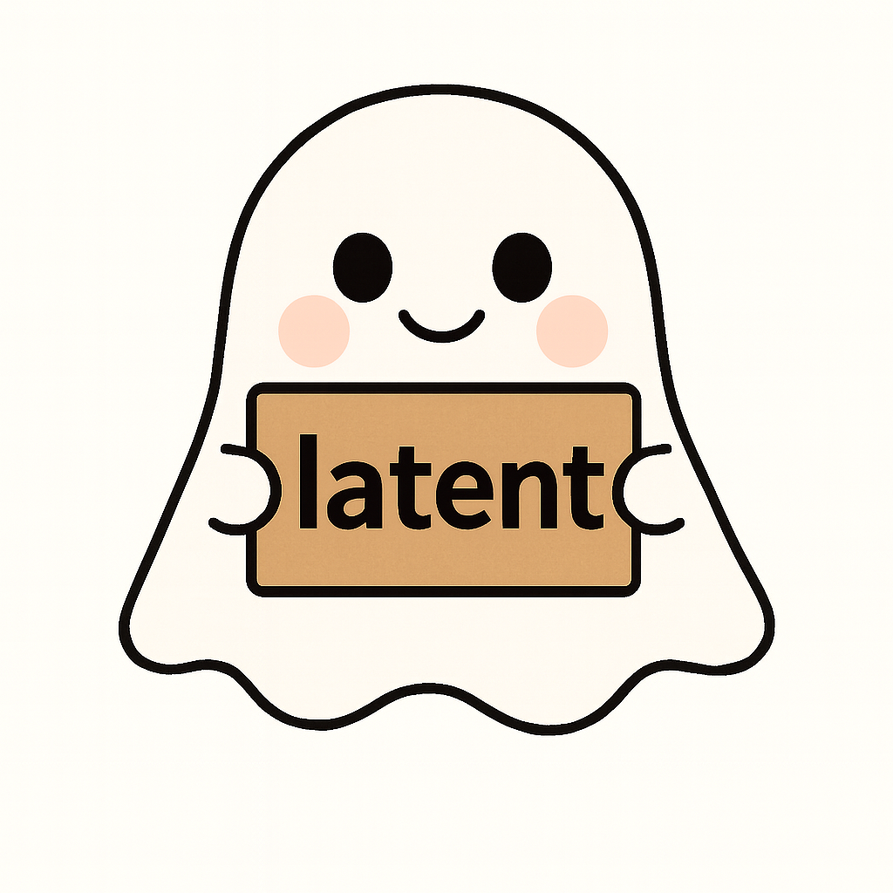

# latent: Latent Class and Factor Analysis Models

Fit measurement models with discrete or continuous latent variables.

# Installation in Windows and Linux

    devtools::install_github("marcosjnez/latent")

# Installation in macOS

Install Command Line Tools:

    xcode-select --install

Install Homebrew:
 
    /bin/bash -c "$(curl -fsSL https://raw.githubusercontent.com/Homebrew/install/HEAD/install.sh)"
    
Install OpenMP support:

    brew update && brew install libomp
    
Update Makevars

    add the following lines to ~/.R/Makevars.

On Intel Macs:

    CPPFLAGS += -Xclang -fopenmp
    LDFLAGS += -lomp

On Apple Silicon Macs (make sure this goes at the end of the file):

    LDFLAGS += -L/opt/homebrew/opt/libomp/lib -lomp
    CPPFLAGS += -I/opt/homebrew/opt/libomp/include -Xclang -fopenmp

Finally,

    devtools::install_github("marcosjnez/latent")

## Funding
The package development is supported by the “DYNANSE: Righting the Wrongs. A Life Course Dynamics Approach for Non-Standard Employment” project, which has received funding from the European Research Council (ERC) under the European Union’s Horizon 2020 research and innovation programme (grant agreement No 864471).
