# Measurement Models

“A foundational part of science is defining and measuring what is being studied. Before one can study the etiology of depression or the efficacy of an intervention to treat it, one must define the construct under investigation and build instruments that measure it accurately… Identifying and defining constructs is central to developing theory in psychology, because developing some initial way to measure constructs must occur before they can be studied empirically” (Flake & Fried, 2020)

# Classical test theory

- Even simple measures include a level of random error, that is unrelated to the True score

$$E(x) = T + e$$

$$e \sim N(0, \sigma)$$

- Accounts for random measurement error
- Direct translation of Linear models
- But, now everything that not True score, is random error
  - Age .. error by months for example

# Modeling framework

- Modeling tradition expands on classical test theory

$$E(x) = T + C + ... + e$$

- Where we still have the random measurement error
- Accounts for “real” information, that is not related to the underlying True construct
- For example, item format, time of the day, … mood,
- Salary: per hour, hours of work, self-employed, yearly

# Partition of variance

- Observed = common + specific + error
  - Reliability: common + specific
  - Unique: specific + error
  - Unreliability: error
- Here we attempt to “model” the different sources of information in a variable
- Requires us to think and expand on what are we measuring? How is it measure? What specific elements can affect it?
- Specific variance can be interpret as “systematic” error/bias

# Modeling framework

- How can we approach this partition?
- Need to multiple indicators/items to approximate the True underlying construct
- Measurement models such as: EFA, CFA, IRT, LCA, LPA

# A construct is what indicators share

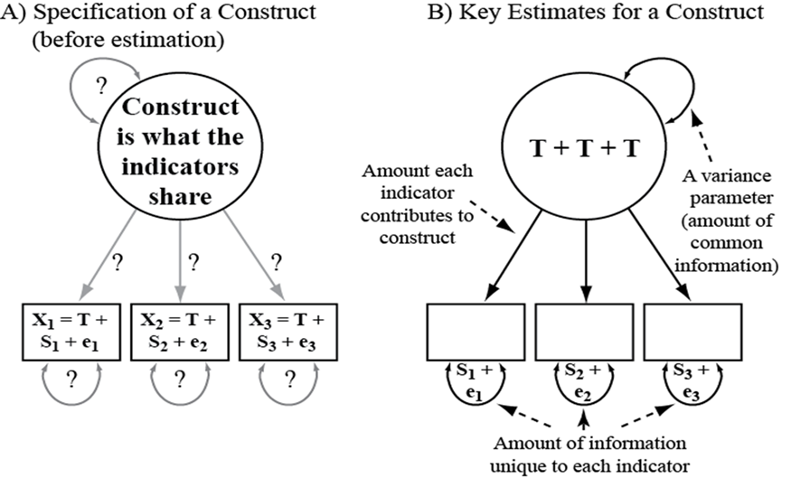

# A construct is what indicators share

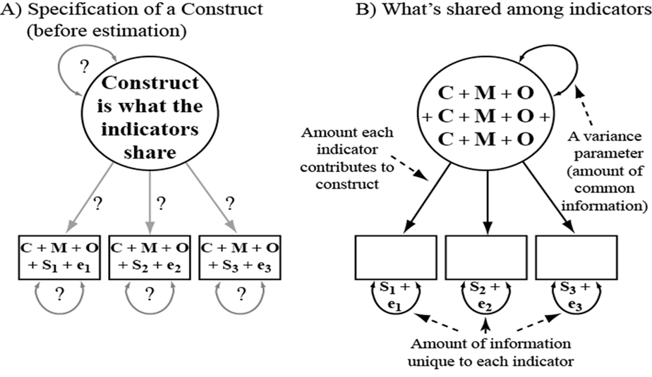

# Effects of ignoring

```{r, echo=FALSE}
#| fig-width: 8
#| fig-height: 5

library(lavaan)
library(semPlot)

dat <- HolzingerSwineford1939
dat$vis <- rowMeans(dat[,c("x1","x2","x3")])
dat$tex <- rowMeans(dat[,c("x4","x5","x6")])
dat$spd <- rowMeans(dat[,c("x7","x8","x9")])

HS.model <- ' visual  =~ x1 + x2 + x3
              textual =~ x4 + x5 + x6
              speed   =~ x7 + x8 + x9 '

fit <- cfa(HS.model, data = HolzingerSwineford1939, std.lv=T)

semPaths(fit)
```

# Effects of ignoring

- Attenuation of relations (random bias)

- Systematic error/bias

- Uncorrected correlations

\footnotesize

```{r}
## average items
round(cor(dat[,c("vis","tex","spd")]),3)
```

- \normalsize Measurement error corrected correlations

\footnotesize

```{r}
## measurement model
lavInspect(fit, "cor.lv")
```

# Selecting indicators

- Understand the circumstances when *good* indicators are bad, and *bad* indicators are good

  - Good reliability, poor validity?

# Selecting indicators

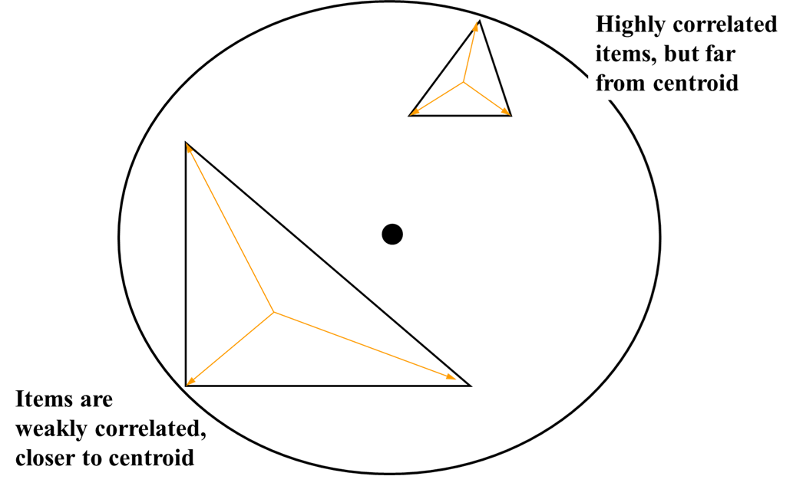

# Selecting indicators

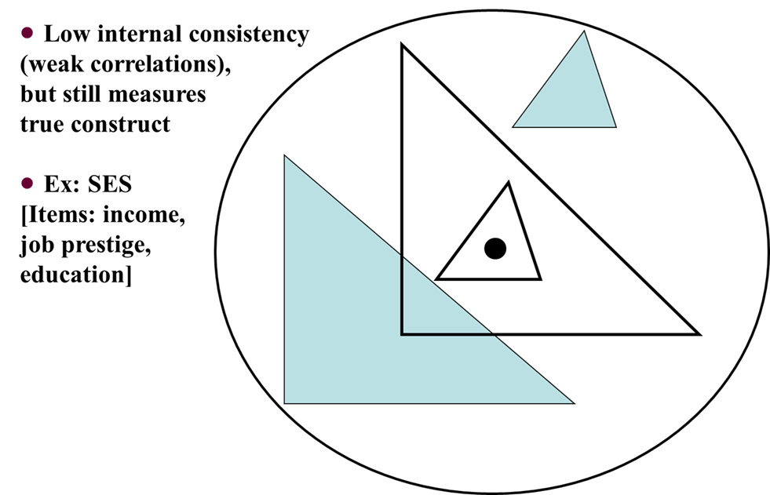

# Selecting indicators

- Think of indicators as the **symptoms** of the construct
- Which symptoms do you want to take into account, and which ones do you want to ignore?
- Example, Math ability
  - 2+2
  - 9\*2
  - Explain differential equation models
  - All are examples of math ability, but at different levels, your indicators have to appropriate for the level of interest and/or the sample

# “There is no true model…”

- Models are parsimonious approximations of real world phenomena

- Equivalent models may be just as appropriate

- Models with good fit are not necessarily meaningful (i.e., does not imply effect size)

- “A finding of good fit does not imply that a model is correct or true, but only plausible” (MacCallum& Austin, 2000)

# Why do we care for latent variables?

\small

- Corrects for (random) measurement error
  - decreases the bias of the true relations on the population
- Allows to estimate complex models, for example systematic measurement error
- Theoretically sound for variables that cannot be measured directly
- Detect *bad* and *good* indicators, instead of assuming that all the indicators correspond to a homogeneous latent variable
- With the measurement model we improve the validity (content, discriminant, ecological, external) of the overall research
- Represent complex theories in a single model, while we are able to test theoretical elements that are treated as assumptions with manifest variables

\normalsize

# Why do we care for latent variables?

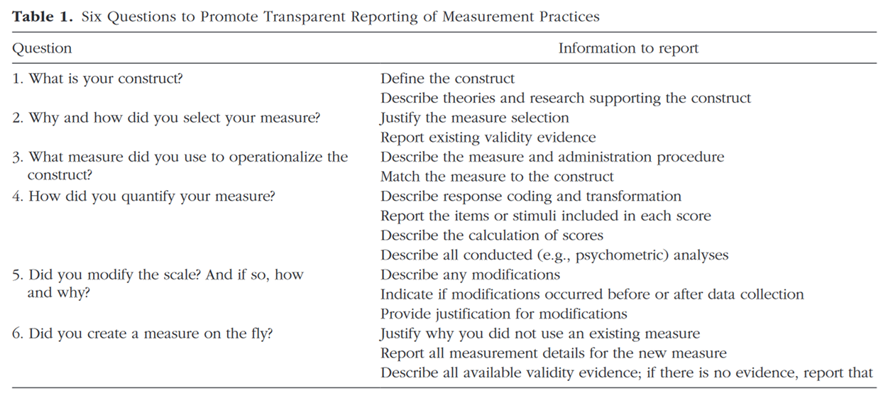

# Person-centered vs Variable-centered

- Person-centered approaches describe similarities and differences among individuals with respect to how variables relate w each other and are predicated on the assumption that the population is heterogeneous with respect w the relationships between variables
- Variable-cenrered approaches describe associations among variables and are predicated on the assumption that the population is homogeneous with respect to the relationships between variables
- Complementary views
- Theoretically and practically, choose the most fitting type of model


# Latent Class Analysis

- Latent Class Analysis (LCA) is a statistical model to uncover hidden groupings in empirical data. More specifically, it is a way to group subjects from multivariate data into latent classes — groups or subgroups with similar, unobservable, membership – based on their pattern of responses on a set of (categorical) measured variables (Collins & Lanza, 2010)

  - The term latent implies that the analysis is based on an error-free latent variable (Collins & Lanza, 2010).
  - A latent or “hidden” variable is not directly measurable or observable. Instead, it is measured indirectly by means of two or more observed variables (indicators)

- **Classes** are groups formed by uncovering hidden (latent) patterns in data.

# Latent Class Analysis

- \small How do the two subgroups (latent classes) identified differ? Solution: The estimates indicate that those in Latent Class 1 have a high probability of passing all these tasks successfully, whereas those in Latent Class 2 have a low probability of passing the tasks successfully

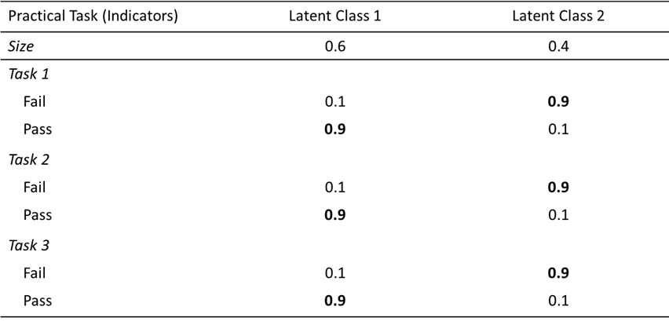

# Latent Class Analysis

- Latent variable Model
- **Categorical** latent variable (person centered)
- Generally exploratory approach
- Separates groups
  - maximizing homogeneity within class, and heterogeneity between classes

# LCA and other latent variable models

- Latent variable models can be organized according to
  - whether the latent variable is categorical or continuous, and
  - whether the indicator variables are treated as categorical or continuous
- The key difference between the latent class and factor analysis models lies in the nature and distribution of the latent variable.

+-----------------------------------+----------------------+-------------------------+
|                                   | Continuous LV        | Categorical LV          |
+===================================+======================+=========================+
| Indicators treated as continuous  | Factor Analysis      | Latent Profile Analysis |
+-----------------------------------+----------------------+-------------------------+
| Indicators treated as categorical | Item Response Theory | Latent Class Analysis   |
+-----------------------------------+----------------------+-------------------------+

# LCA and other latent variable models

- These are more historical distinctions than necessary ones
- Related to the original development and computational limitations
- We can do factor analysis with both continuous and categorical indicators
- LCA was originally developed to work with **only** categorical indicators
- Software would handle either categorical or continuous indicators (LCA vs LPA)
- Now advance software can handle both types of indicators
- I will only use **Latent Class Analysis** (with categorical or continuous indicators)

# Difference between LCA and Factor Analysis

\small

- Ruscio and Ruscio (2008) outline the differences between the two:
  - **Categorical latent variables (LCA)**: “…qualitative differences exist between groups of people or objects”.
  - **Continuous latent variables (Factor Analysis)**: “…people or objects differ qualitatively along one or more continua.”

\scriptsize

+-----------------------------------------------------------------------------------------------------------------------------------------------------------------------------------------------------------------------------------------------+-------------------------------------------------------------------------------------------------------------------------------------------------------------------------+
| LCA: Person-oriented                                                                                                                                                                                                                          | FA: variable-oriented                                                                                                                                                   |
+===============================================================================================================================================================================================================================================+=========================================================================================================================================================================+
| - Emphasis is on the individual as a whole                                                                                                                                                                                                    | - Emphasis on identifying relations between variables with the assumption that these relations apply across all individuals                                             |
|                                                                                                                                                                                                                                               |                                                                                                                                                                         |
| - Describe similarities and differences among individuals with respect to how variables relate to each other and are predicated on the assumption that the population is **heterogeneous** with respect to the relationship between variables | - Describe associations among variables and are predicated on the assumption that the population is **homogeneous** with respect to the relationships between variables |
+-----------------------------------------------------------------------------------------------------------------------------------------------------------------------------------------------------------------------------------------------+-------------------------------------------------------------------------------------------------------------------------------------------------------------------------+

# Univariate example: **Homogeneous** sample (shoe size)

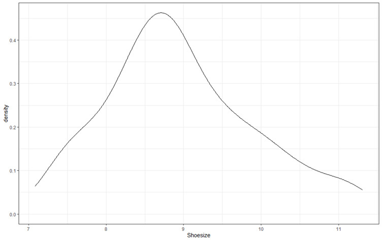

# Univariate example: **Heterogeneous** sample (shoe size)

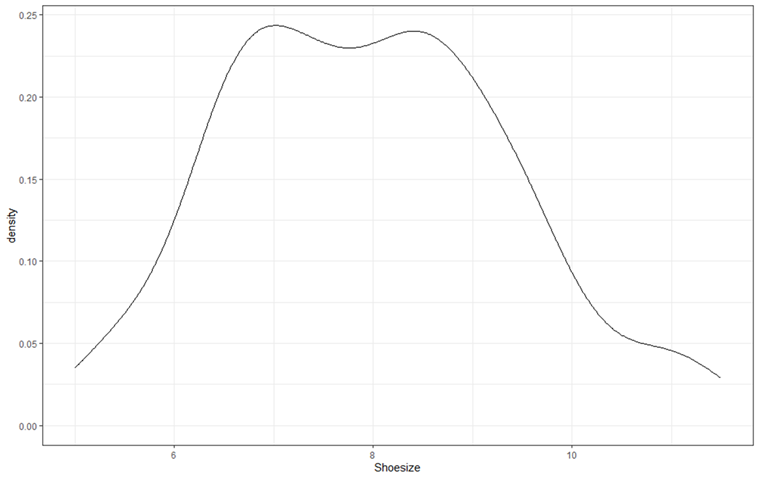

# Univariate example: 2 class univariate model

- With LCA, we estimate the proportion of the sample that belongs to each class.

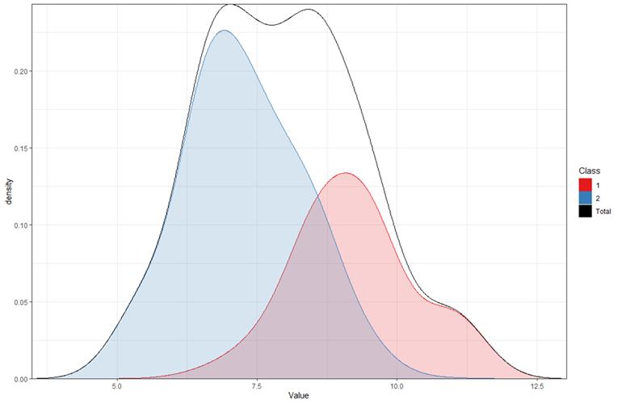{width="70%," height="70%"}

# LCA: Probabilistic model

- LCA is a statistical model in which individuals can be classified into **mutually exclusive and exhaustive latent classes**, based on their pattern of answers on a set of (categorical) measured variables.
  - Every individual belongs to one and only one latent class
- But:
  - It is important to note that according to the latent class model, this classification is **probabilistic**. In other words, the model does not *know* each individual's latent class membership. Instead, corresponding to each individual there is a vector of probabilities of membership in each latent class.

# Model assumptions

- Linear relation between the latent variable and the indicators (logistic for categorical indicators)

- **Local independence of the indicators**: the indicators are unrelated above and beyond the latent variable, latent class membership explains all of the associations among the observed items (see Figure).

# Model assumptions

- This figure illustrates a violation of local independence. Observed variables X2 and X3 are related to each other not only through the latent variable, but also through their error components ($e$)

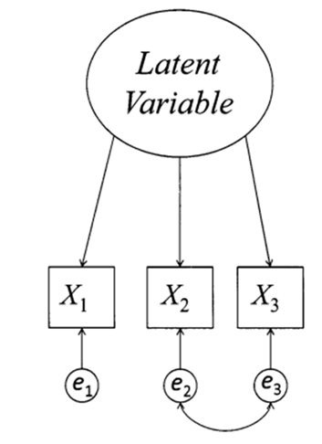{width="70%," height="70%"}

# Model notation

\small

- The starting point for conducting a LCA on empirical data is a contingency table formed by cross-tabulating all the observed variables to be involved in the analysis.

- A latent class model is made up of (a set of) estimated parameters:

  - **Latent class prevalences**, formally referred to as $\gamma$ (gamma’s), are the probabilities of membership in each latent class.
  - **Item-response probabilities**, formally referred to as $\rho$ (rho’s), which is the probability of a particular response to a particular item, conditional on membership in a particular latent class.

- … that can be used to obtain expected cell proportions for a contingency table. If the model fits the data well, the expected cell proportions closely match the observed cell proportions.

- Suppose that there are

  - $j=1,...,J$ observed variables
  - $r_j = 1,...,R_j$ response categories The contingency table formed by cross-tabulating the $J$ variables has $W = \sum^J_{j=1} R_j$ cells.

# Model notation

::::: columns
::: {.column width="50%"}
Solution:

- the observed variables are the questionnaire items, $J=4$
- For the first questionnaire item there are two response alternatives, *No* and *Yes*, so $𝑅_1=2$
- $𝑅_2=3$; $𝑅_3=3$ ; $𝑅_4=3$ ,
- Therefore, in that example,
  - $𝑊=2∗3∗3∗3=54$
:::

::: {.column width="50%"}
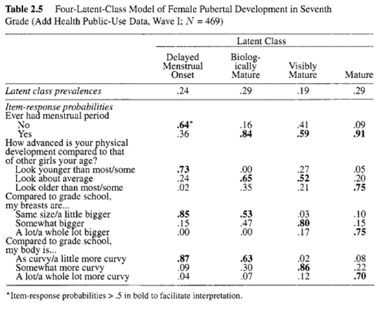
:::
:::::

# Model notation

- Corresponding to each of the $𝑊$ cells in the contingency table is a complete response pattern, which is a vector of responses to the $𝐽$ variables, represented by

$$y = (r_1 , ... , r_J) $$

- Let $𝑌$ refer to the array of response patterns. $𝑌$ has $𝑊$ rows and $𝐽$ columns. Each response pattern $𝑦$ is associated with probability

$$P(Y = y), and \sum P(Y = y) = 1$$

# Model notation

\scriptsize

- Let $𝐿$ represent the categorical latent variable with $𝑐 =1,… , 𝐶$ latent classes.
  - $\gamma_c$ represents the prevalence of latent class $𝑐$ (= the probability of membership in latent class $𝑐$ of latent variable $𝐿$)

We know that … - Latent classes are mutually exclusive and exhaustive; meaning each individual is a member of one and only one latent class. Therefore,

$$\sum_{c=1}^{C} \gamma_{c} = 1$$

- The set of $\rho$ parameters (also, measurement parameters) expresses the relation between each observed indicator variable and each latent class. Because each individual provides one and only one response alternative to variable $𝑗$, the vector of item-response probabilities for a particular variable conditional on a particular latent class always sums to 1. Therefore, for all $𝑗$

$$\sum_{r_j = 1}^{R_j} \rho_{j,r_j | c} = 1 $$

- with $\rho_{j,r_j | c}$ representing the probability of response $𝑟_𝑗$ to observed variable $𝑗$, conditional on membership in latent class $𝑐$

# Model Notation: Fundamental expression

- Let $y_j$ represent element $𝑗$ of a response pattern $𝑦$. Let us establish an indicator function $I(𝑦_𝑗  =𝑟_𝑗)$ that equals 1 when the response to variable $𝑗 = 𝑟_𝑗$ , and equals 0 otherwise.

- This equation expresses how the probability of observing a particular vector of responses is a function of the probabilities of membership in each latent class (the $\gamma$ ) and the probabilities of observing each response conditional on latent class membership (the $\rho$):

$$P(Y = y) = \sum_{c=1}^{C} \gamma_C \prod_{j=1}^{J} \prod_{r_j =1}^{R_j} =  \rho_{j,r_j | c}^{I(𝑦_𝑗  =𝑟_𝑗)} $$

# LCA example

- European Social Survey Round 10 - France

- There are different ways of trying to improve things in \[country\] or help prevent things from going wrong. During the last 12 months, have you done any of the following? Have you... (Yes =1, No=2)

  - ... contacted a politician, government or local government official?\
  - ... worn or displayed a campaign badge/sticker?\
  - ... signed a petition?\
  - ... boycotted certain products?\
  - ... donated to or participated in a political party or pressure group?\
  - ... volunteered for a not-for-profit or charitable organisation?\
  - ... taken part in a public demonstration?\
  - ... posted or shared anything about politics online, for example on blogs, via email or on social media such as Facebook or Twitter?

# LCA Example: (1) Naming the latent variable

- With LVMs we need to defined what is the latent variables that we are measuring
- Relates to the construct validity, what does the items represent?
- **Political Activism**

# Evaluating model fit and model selection

- Part of the process of latent class analysis involves **deciding on the correct number of classes**, also called **class enumeration**.
  - LCA is most commonly used as an **exploratory method** that requires substantial interpretation of the results to derive the final model
- Different types of criteria to evaluate fit of a latent class models:
  - Global fit
    - Information criteria for model comparison (BIC, AIC)
  - Substantive
    - Change in the solution when adding another class or parameters
- Formally, the best cluster solution is obtained when the information criteria reach the minimum. Nonetheless, it is even more important that the cluster solution is theoretically meaningful and valid (Bacher & Vermunt, 2010).

# Model selection: Determining the number of classes

- Two important theoretical criteria

  - Parsimony
  - Interpretability

- **Parsimony**: philosophical principle stating that all else being equal, simpler models are preferred to more complex models. Here simpler means "estimating fewer parameters." According to this principle, statistical models should be no more elaborate, that is, should estimate no more parameters, than is absolutely necessary to represent the data adequately (Collins & Lanza, 2010, p. 82; Box & Jenkins, 1976, p. 17).

- **Interpretability**: The investigator’s background, experience and familiarity with prior literature on the topic must be drawn upon to judge whether a particular model is interpretable and provides useful insights that help to move science forward.

# Model selection: Information Criteria

\footnotesize

- Statistical Criteria: Several different information criteria have been proposed as a way to compare the relative balance of model fit and parsimony (i.e., model simplicity) when choosing between competing models. Fit indices typically used for determining the optimal number of classes include:

  - **Akaike information criterion** (AIC; Akaike, 1987)
  - **Bayesian Information criterion** (BIC; Schwartz, 1978)

- Both information criteria are based on the -2\*log-likelihood, and add a penalty for the number of parameters (thus incentivizing smaller models). This helps balance model fit and model complexity.

- A smaller value represents a better model fit, for all information criteria. A model with the minimum AIC or BIC might be selected (remember: solution needs to be theoretically meaningful).

- Note: The different information criteria often do not identify the same model as optimal, due to the varying penalties associated with each criterion (see Collins & Lanza, 2010, p.88).

  - Information criteria are likely to be more useful in ruling out models and narrowing down the set of plausible options than in pointing unambiguously to a single best model.

# Model selection: Information Criteria

- Correct for overfittins

- **Akaike information criterion** (AIC; Akaike, 1987): approximates the out-of sample prediction accuracy

$$AIC = -2LL+2p$$

- **Bayesian Information criterion** (BIC; Schwartz, 1978): a large-sample approximation to the Bayes factor.

$$BIC = -2LL+ p \ln(n)$$

- The BIC generally penalizes free parameters more strongly than the AIC, though it depends on the size of $n$ and relative magnitude of $n$ and $p$.

# Expectation Maximization (EM)

\small

- Most commonly EM is the optimization method for mixture models
- EM is an iterative algorithm that can be generally applied to problems with missing or latent data, where maximum likelihood estimation would be easy if we knew the missing or latent values.
- The general idea behind the EM algorithm is to impute expected values for the latent states and then estimate parameters by optimizing the joint likelihood of the parameters given the observations and imputed latent states.

\scriptsize

- The key idea behind EM is to compute the expected value of the model from a set of initial parameter values and the observations (**Expectation** step). While computed using initial parameter values $\theta'$,this expected complete-data likelihood is still a function of parameters $\theta$ , but no longer of the unobserved states $C$. Thus, the expected likelihood can be maximized by finding the optimal values of $\theta$. This is done in the **Maximization** step, resulting in new parameter estimates. These new parameter estimates are then used to recompute the expectation of the model, which is then maximized to obtain new parameter estimates. The expectation and maximization steps are repeated until convergence

# Expectation Maximization (EM)

- This process is computer intensive
- Mixture models likelihood functions can have complex distributions
- So, the model can *converge* in a bad solution: called **local maxima**
- To prevent this we estimate the models with multiple starting values, and select the model with the best $LL$

# Class Enumeration

- We estimate LCAs with increase number of $C$ classes
- Compare the models ICs
- Choose 1 or 3 models that present *similar* fit to evaluate the theoretical interpretability

# The latent R package

```{r eval=TRUE, echo=FALSE}
library(latent)
```

::: {.columns}
::: {.column width="70%"}

- Few arguments for a straightforward analysis  
- lavaan syntax for Structural Equation Models
- Customizable models
- Core functions written in C++ with the armadillo library
- Parallelization of multiple random starts to address local maxima  

{width=300%}

:::
::: {.column width="30%"}
{width=300%}
:::
:::

# High-performance computing

::: {.columns}
::: {.column width="70%"}

<!-- <details markdown="1"> -->
<!-- <summary>High-performance computing</summary> -->

- Core functions written in C++ with the armadillo library

{width=150%}

- Parallelization of multiple random starts to address local maxima  
{width=30%}

<!-- </details> -->

:::
::: {.column width="30%"}
{width=300%}

:::
:::


# LCA example

\tiny

```{r}
library(collapse)
library(summarytools)
library(stevemisc)
library(ggplot2)
library(patchwork)

# ESS_datLCA <- rio::import("ESS_datLCA.sav")
dat <- sbt(ESS_datLCA, cntry == "FR")
dat <- tidyr::drop_na(dat)

dat[,1:8] <- dapply(dat[,1:8], MARGIN = 2,
                    function(x) carrec(x,"1='Yes';2='No'"))

dat$gndr <- carrec(dat$gndr, "1='Men'; 2 ='Women' ")

freq(dat[,1:2])

```

# LCA example

\tiny

```{r}
freq(dat[,3:4])

```

# LCA example

\tiny

```{r}
freq(dat[,5:6])

```

# LCA example

\tiny

```{r}
freq(dat[,7:8])

```

# LCA example

- Minimal `latent` code

```{r}
fit1 <- lca(data = dat, nclasses = 1:7,
           multinomial = c("contplt", "badge", "sgnptit", "bctprd", 
                           "donprty", "pbldmna", "volunfp","pstplonl") )

```

# LCA example

- We tested the models from 1 to 7 classes

```{r}
fit_ind <- getfit(fit1, digits = 2)
fit_ind
```

# LCA example

\scriptsize

```{r}
#| fig-width: 8
#| fig-height: 5

plot(fit_ind)

```

# LCA example

- Which model would you choose in function of the ICs?

  - See the solution for 2 and 3 classes, to evaluate the theoretical interpretation


# LCA example
 
::::: columns
::: {.column width="50%"}
 - 2-class solution
```{r}
pr2 <- latInspect(fit1[[2]], "profile")
pr2$class
pr2$item[1:3]
```
:::

::: {.column width="50%"}
```{r}
pr2$item[4:8]
```
:::
:::::


# LCA example


::::: columns
::: {.column width="50%"}
- 3-class solution
```{r}
pr3 <- latInspect(fit1[[3]], "profile")
pr3$class
pr3$item[1:3]
```
:::

::: {.column width="50%"}
```{r}
pr3$item[4:8]
```
:::
:::::


# LCA example

- (will continue with the 3 class solution)

- From the chosen solution (here 3 classes), we need to **assign names to each latent class**

  - based on what characterizes it (qualitative differences among the groups).
  - The interpretation of the latent classes is based on the item-response probabilities.

# LCA example

```{r}
#| fig-width: 8
#| fig-height: 5

fit1_3 <- fit1[[3]]

plot(fit1_3)

```


# LCA example

- What would you named the classes?
  - It seems we have a class of *Not politically active*, with 59% of the sample
  - Then we have a class that is *Somewhat active*, with 35% of the sample
  - And lastly we have a *Very active*, with 6% of the sample

\small

```{r}
latInspect(fit1_3, "classes")
```

# LCA example: Classification Diagnostics

```{r}
cl_diag <- lclass_diag(fit1_3, digits = 3, type = "all")
```

- We can compare the posterior class probabilities

```{r}
cl_diag$Sum.Posterior
```

- With the most likely class membership based on the highest posterior class probability

```{r}
cl_diag$Sum.Mostlikely
```

# LCA example: Classification Diagnostics

\scriptsize

- **AvePP**: average predicted probability for the subjects clarified in each class

```{r}
cl_diag$AvePP
```

- **Entropy**: summarizes class separability in a single statistic (Celeux & Soromenho, 1996). In physics, high entropy refers to maximum randomness or uncertainty, and low entropy corresponds to a strict arrangement of the units of study. In LCA, high entropy means that classes are completely indistinguishable, and low entropy means that classes are fully separated ($1-entropy$).

```{r}
cl_diag$Entropy
```

# LCA example: Classification Diagnostics

- You can see all the classification diagnostics provided by `latent`

```{r}
cl_diag
```

# LCA example: predicted classes

- We can save the predicted classes, and predicted probabilities
- Can do descriptive statistics post estimation (be aware you may have error based on the predicted probabilities)

```{r}
latInspect(fit1_3, "state")
```

# LCA example: predicted classes

- For example, what is the distribution of men and women across each class?

\tiny

```{r}
dat$State <- latInspect(fit1_3, "state")
ctable(dat$gndr, dat$State, prop="c")
ctable(dat$gndr, dat$State, prop="r")
```


# Global model fit evaluation

- One of the first things users do is test the model fit
- Global model fit is usually measure with a variety of indices
- Commonly done by reporting $\chi^2$ ($LL$) overall model fit indices, and relative fit indices to compare models (AIC and BIC)

# Global model fit evaluation

- The most common test of global fit is the $\chi^2_{LR}$
- Under the null hypothesis that the data are governed by the assumed distribution of the specified model
- Test of *absolute* fit
- Follows a $\chi^2$ distribution
- It is considered a sensitivity test for small/negligible misfit, as it is very sensitive (specially with large sample sizes)

# Global model fit evaluation

- In `latent` we can see Likelihood‑ratio chi‑square ($L^2$) for categorical indicators

$$
L^2 = 2 \sum_{s=1}^{S} n_s^{\text{obs}} \log \left( \frac{n_s^{\text{obs}}}{e_s^{\text{obs}}} \right)
$$

- From the `getfit()` function

```{r}
getfit(fit1_3)[c("L2","dof","pvalue")]
```

# Local model fit evaluation

- After the global fit has been evaluated, we would evaluated if there is local misfit
- Seeking to identify if the model fails to fit specific variables
- Can be evaluated with residual correlations, but they can determine which variable is not properly predicted by the model. But it doesn't specifies how to fix it
  - A type of residual correlations in LCA are the Bivariate residuals (BVR)
- Think of them as tests for the assumption of local independence

# Residual correlations

- Relation that exists between any two variables above and beyond the latent variable
- In this example we have only categorical variables
- How can we evaluate residual correlation for them?


# Standardized Pearson Residuals for Bivariate Residuals

- For a pair of categorical items $i$ and $j$, let $O_{rc}$ be the observed count of cases with item $i = r$ and item $j = c$, and $E_{rc}$ the expected count under the fitted latent class model (with local independence). 

- The **standardized Pearson residual** for cell $(r,c)$ is

$$
e_{rc} = \frac{O_{rc} - E_{rc}}{\sqrt{E_{rc}}}.
$$

- $e_{rc}$ approximately follows a standard normal distribution for large $N$. 
- Values $|e_{rc}| > 2$ (or $> 3$) indicate a cell‑wise deviation larger than expected by chance, suggesting residual dependence.

The *bivariate residual* for the pair is often taken as

$$
\text{BVR}_{ij} = \max_{r,c} |e_{rc}|,
$$

- maximum absolute standardized residual over all cells of the two‑way table. 
- This is the `statistic` returned by the `lbvr` function for multinomial–multinomial pairs.


# Cramér’s V as an Effect Size Measure

- Cramér’s $V$ is a measure of association between two categorical variables, ranging from 0 (no association) to 1 (perfect association). For a contingency table with $L_i$ rows and $L_j$ columns, it is defined as

$$
V = \sqrt{\frac{\chi^2}{N \cdot \min(L_i-1,\, L_j-1)}},
$$

where $\chi^2$ is the Pearson chi‑square statistic.

# Cramér’s V as an Effect Size Measure

- In the context of LCA diagnostics, we can compute:

  - $V_{\text{obs}}$ from the observed table,
  - $V_{\text{exp}}$ from the expected table under the LCA model

- The difference $V_{\text{obs}} - V_{\text{exp}}$ indicates how much additional association is present in the data beyond what the latent classes already explain. Positive values point to possible local dependence.

- The `lbvr` function returns this difference as the **effect size** `r` for multinomial–multinomial pairs.

# RMSR as an Overall Residual Metric

- **Root Mean Square Residual** (RMSR) summarises the residual associations across all variable pairs into a single number. For a set of $J$ variables, let $r_{ij}$ be a correlation‑like effect size for the pair $(i,j)$:

- RMSR is then computed as

$$
\text{RMSR} = \sqrt{\frac{2}{J(J-1)} \sum_{i<j} r_{ij}^2}.
$$

- Between 0 and 1, with values closer to 0 indicating that residual dependencies are small on average. 
- The RMSR is useful for comparing models (e.g., different numbers of classes) or as a benchmark: $\text{RMSR} < 0.1$ is often considered good fit.

# Residual evaluation in `latent`

```{r}
res_diag <- lbvr(fit1_3, digits = 3)
res_diag
```

Refit the LCA model with 3 classes and the residual dependency between `contplt` and `volunfp`.

```{r}
fit1_3_resid <- lca(data = dat, nclasses = 3,
                    multinomial = c("contplt", "badge", "sgnptit", "bctprd",
                                    "donprty", "pbldmna", "volunfp","pstplonl"),
                    model = list("contplt ~~ volunfp"))

ci_fit1_3_resid <- ci(fit1_3_resid, confidence = 0.95)
ci_fit1_3_resid$table$log_contpltxlog_volunfp
```

# Residual evaluation in `latent`

- We provide a measure of overall residual evaluation (RMSR)
- And local residual evaluation

# Local model fit

- You have found that there are local violations of local independence
- Then you can *model* a residual correlation between the *problematic* variables
  - Change the model one parameter at the the time
  - compare the 2 models
  - Test for local fit again
  - Repeat
- Can also check of the modification affect the model interpretation (sensitivity analysis)


# LCA with continuous indicators

- Typically called *Latent Profile Analysis*
- But we can do LCA with only categorical, only continuous, or a combination of indicator's types
- Most of what we have already talked applies the same way for LCA with continuous indicators
- The main difference is on the model that relates the latent variable to the indicators
- As before we were estimating *logistic* regressions, but now we will estimate *gaussian* regressions

# LCA with continuous indicators

$$
\sigma^2_i = \sum^{C}_{c=1} \pi_{c}(\mu_{ic} - \mu_i)^2 + \sum^{C}_{c=1} \pi_{c} \sigma^2_{ic}
$$

- where $\mu_{ic}$ and $\sigma^2_{ic}$ represent profile-specific ($c$) means and variances for variable $i$, and $\pi_{c}$ indicates profile density, or the proportion of $N$ participants that belong to profile $c$.
- Assumes (1) samples drawn from a heterogeneous population produce data that are a mixture of $c$ profile-specific distributions; (2) observed $y$ indicator variables are distributed normally; and (3) the profile-specific mean vectors $\mu_c$ are the profile-specific ($c$) observed variable means.

# LCA with continuous indicators

- If both separate mean vectors ($\mu_c$) and separate covariance matrices ($\sum_c$) were freely estimated for all of the K latent profiles contained in the data, the number of estimated parameters would quickly increase
- Commonly, co-variances between variables are constrained to 0
- **Local independence**: conditional on correct latent profile extraction or enumeration, all $y$ are uncorrelated within each $c$ latent profile, and all k-specific off-diagonal covariance matrix elements are zero.
- **Homogeneity assumption**: profile-specific covariance matrix elements along the main diagonal are constrained to equality across all $c$


# LCA with continuous indicators

```{r}
bfi <- psych::bfi

vars_rev <- c("A1","C4","C5","E1","E2","O1","O3","O4")

bfi[,vars_rev] <- dapply(bfi[,vars_rev], MARGIN = 2,
                    function(x) carrec(x,"1=6; 2=5; 3=4; 4=3; 5=2; 6=1"))


bfi$Agreeableness <- rowMeans(bfi[,paste0("A",1:5)], na.rm=T)
bfi$Conscientiousness <- rowMeans(bfi[,paste0("C",1:5)], na.rm=T)
bfi$Extraversion <- rowMeans(bfi[,paste0("E",1:5)], na.rm=T)
bfi$Neuroticism <- rowMeans(bfi[,paste0("N",1:5)], na.rm=T)
bfi$Openness <- rowMeans(bfi[,paste0("O",1:5)], na.rm=T)

#head(bfi)
```

- **The Big Five Personality Model** as assessed in the [International Personality Item Pool](https://ipip.ori.org)

  - Agreeableness (e.g., “I inquire about others’ well-being”)
  - Conscientiousness (e.g., “I continue until everything is perfect”)
  - Extraversion (e.g., “I don’t talk a lot.”)
  - Neuroticism (e.g., “I get irritated easily.”)
  - Openness (e.g., “I am full of ideas.”)

- Do we find profiles of personalities characteristics?

# LCA with continuous indicators

- Look at the data

\tiny

```{r}
summarytools::descr(bfi[,29:33])
```


# LCA with continuous indicators

```{r}
#| fig-width: 8
#| fig-height: 5

ggplot(bfi, aes(x=Agreeableness))+geom_density()+
  ggplot(bfi, aes(x=Conscientiousness))+geom_density()+
  ggplot(bfi, aes(x=Extraversion))+geom_density()+
  ggplot(bfi, aes(x=Neuroticism))+geom_density()+
  ggplot(bfi, aes(x=Openness))+geom_density()
```

# LCA with continuous indicators

```{r}
#| output: false

set.seed(1987)

fit2 <- lca(data = bfi, nclasses = 1:7,
           gaussian = c("Agreeableness", "Conscientiousness", 
                        "Extraversion", "Neuroticism", "Openness" ) )
```

- Evaluate model fit indices for 1 to 7 classes

```{r}
fit_ind_cont <- getfit(fit2, digits = 2)
fit_ind_cont
```

# LCA with continuous indicators

\scriptsize

```{r}
#| fig-width: 8
#| fig-height: 5

plot(fit_ind_cont)
```

# LCA with continuous indicators

- Check class proportions for several solutions
- Will use 4 classes also for this example

\tiny

```{r}
latInspect(fit2[[3]], "classes")
latInspect(fit2[[4]], "classes")
latInspect(fit2[[5]], "classes")
```

# LCA with continuous indicators

\tiny

::::: columns
::: {.column width="50%"}
```{r}
fit2_4 <- fit2[[4]]

pr4 <- latInspect(fit2_4, "profile")
pr4$class
pr4$item[1:2]
```
:::

::: {.column width="50%"}
```{r}
pr4$item[3:5]
```
:::
:::::

# LCA with continuous indicators

\tiny

```{r}
#| fig-width: 8
#| fig-height: 5

plot(fit2_4)

```


# LCA example

- What would you named these classes?

\small

```{r}
latInspect(fit2_4, "classes")
```

# LCA example: Classification Diagnostics

```{r}
cl_diag_cont <- lclass_diag(fit2_4, type = "all", digits = 3)
```

- We can compare the posterior class probabilities

```{r}
cl_diag_cont$Sum.Posterior
```

- With the most likely class membership based on the highest posterior class probability

```{r}
cl_diag_cont$Sum.Mostlikely
```

# LCA example: Classification Diagnostics

\scriptsize

- **AvePP**: average predicted probability for the subjects clarified in each class

```{r}
cl_diag_cont$AvePP
```

- **Entropy**: summarizes class separability in a single statistic (Celeux & Soromenho, 1996). In physics, high entropy refers to maximum randomness or uncertainty, and low entropy corresponds to a strict arrangement of the units of study. In LCA, high entropy means that classes are completely indistinguishable, and low entropy means that classes are fully separated ($1-entropy$).

```{r}
cl_diag_cont$Entropy
```

# LCA example: Classification Diagnostics

- Can see all the diagnostics provided by `latent`

```{r}
cl_diag_cont
```


# LCA example: predicted classes

- We can save the predicted classes, and predicted probabilities
- Can do descriptive statistics post estimation (be aware you may have error based on the predicted probabilities)

```{r}
latInspect(fit2_4, "state")
```

# LCA example: predicted classes

- For example, what is the distribution of men and women across each class?

\tiny

```{r}
bfi$Gender <- carrec(bfi$gender, "1='Man';2='Woman' ")
bfi$State <- as.factor(latInspect(fit2_4, "state"))
ctable(bfi$Gender, bfi$State, prop="c")
ctable(bfi$Gender, bfi$State, prop="r")
```

# LCA with continuous indicators

\scriptsize

- Density distributions based on predicted classes

```{r}
#| fig-width: 8
#| fig-height: 5

ggplot(bfi, aes(x=Agreeableness, group = State))+
  geom_density(aes(color = State))+
  ggplot(bfi, aes(x=Conscientiousness, group = State))+
  geom_density(aes(color = State))+
  ggplot(bfi, aes(x=Extraversion, group = State))+
  geom_density(aes(color = State))+
  ggplot(bfi, aes(x=Neuroticism, group = State))+
  geom_density(aes(color = State))+
  ggplot(bfi, aes(x=Openness, group = State))+
  geom_density(aes(color = State))


```

# Model fit

- When we have continuous indicators, the $chi^2$ test is not commonly used in LCA
- Here we will focus on residual evaluation, for both global and local fit

# Residual correlation

- **Residual correlation** measures the linear association between the residuals after accounting for the latent class structure. Under local independence, the residuals should be uncorrelated.

Let:

- $y_{pi}$ be the observed value of individual $p$ on variable $i$,
- $\hat{y}_{pi} = \sum_{k=1}^K \pi_{pk} \, \mu_{ik}$ be the expected value under the model

The residual for individual $p$ on variable $i$ is

$$
e_{pi} = y_{pi} - \hat{y}_{pi}.
$$

# Residual correlation

- For a pair of continuous variables $(i,j)$, the **residual correlation** is simply the Pearson correlation coefficient between $e_{i}$ and $e_{j}$:

$$
r_{ij} = \frac{\sum_{p=1}^N (e_{pi} - \bar{e}_i)(e_{pj} - \bar{e}_j)}{\sqrt{\sum_{p=1}^N (e_{pi} - \bar{e}_i)^2 \; \sum_{p=1}^N (e_{pj} - \bar{e}_j)^2}}.
$$

- In practice, the calculation uses only pairwise complete cases if missing data are present.


# Interpretation

- Under the null hypothesis of local independence (i.e., the latent class model fully explains the relationship between $i$ and $j$), the population residual correlation is zero.
- A residual correlation significantly different from zero indicates that the model fails to capture some linear dependence between the two continuous variables.


**Heuristic benchmarks**:

| $|r_{ij}|$ | Interpretation |
|:---|:---|
| $< 0.10$ | Negligible residual dependence |
| $0.10 - 0.30$ | Weak residual dependence |
| $0.30 - 0.50$ | Moderate residual dependence |
| $> 0.50$ | Strong residual dependence |


# Statistical Test

- The null hypothesis $H_0: \rho_{ij} = 0$ can be tested using the standard t‑test for correlation:

$$
t = r_{ij} \sqrt{\frac{n_{\text{pair}} - 2}{1 - r_{ij}^2}},
$$

- which follows a $t$‑distribution with $n_{\text{pair}} - 2$ degrees of freedom, where $n_{\text{pair}}$ is the number of complete cases for the pair. The p‑value is obtained from this distribution.


# RMSR as an Overall Residual Metric

- **Root Mean Square Residual** (RMSR) summarises the residual associations across all variable pairs into a single number. For a set of $J$ variables, let $r_{ij}$ be a correlation‑like effect size for the pair $(i,j)$:

- RMSR is then computed as

$$
\text{RMSR} = \sqrt{\frac{2}{J(J-1)} \sum_{i<j} r_{ij}^2}.
$$

- Between 0 and 1, with values closer to 0 indicating that residual dependencies are small on average. 
- The RMSR is useful for comparing models (e.g., different numbers of classes) or as a benchmark: $\text{RMSR} < 0.1$ is often considered good fit.

# Residual evaluation in `latent`

```{r}
res_diag2 <- lbvr(fit2_4, digits = 3)
res_diag2
```

Refit the model modeling the residual covariance between `Agreeableness` and `Extraversion`.

```{r}
fit2_4_resid <- lca(data = bfi, nclasses = 4,
            gaussian = c("Agreeableness", "Conscientiousness",
                         "Extraversion", "Neuroticism", "Openness" ),
            model = list("Agreeableness ~~ Extraversion"))

getfit(fit2_4)
getfit(fit2_4_resid)
```

# LCA with continuous and categorical items

- In many cases we will have a mix of variables: continuous and categorical 
- Everything is the *same* as before
- For the categorical items we will have the respective model 

$$
P(Y = y) = \sum_{c=1}^{C} \gamma_C \prod_{j=1}^{J} \prod_{r_j =1}^{R_j} =  \rho_{j,r_j | c}^{I(𝑦_𝑗  =𝑟_𝑗)} 
$$

- And for continuous we will have the respective model

$$
\sigma^2_i = \sum^{C}_{c=1} \pi_{c}(\mu_{ic} - \mu_i)^2 + \sum^{C}_{c=1} \pi_{c} \sigma^2_{ic}
$$

- We will different models for each type of indicator


# LCA with continuous and categorical items

- Dataset with information on high school students’ academic histories
- Four dichotomous variables as indicators (category 0 = no, category 1 = yes)
  - had taken honors math (hm)
  - honors English (he)
  - vocational classes (voc)
  - unlikely to go to college (nocol)
- Four continuous indicators
  - score on a measure of academic achievement for each of the four years of high school (ach9–ach12)

# LCA with continuous and categorical items

```{r}
# dat3 <- rio::import("hs_academic.sav")
dat3 <- hs_academic

vars_rev <- c("hm","he","voc","nocol")

dat3[,vars_rev] <- dapply(dat3[,vars_rev], MARGIN = 2,
                    function(x) carrec(x,"0 = 'No'; 1 = 'Yes' "))

head(dat3)
```


# LCA with continuous and categorical items

```{r}
freq(dat3[,1:4])
```


# LCA with continuous and categorical items

```{r}
summarytools::descr(dat3[,5:8])
```


# LCA with continuous and categorical items

- Class enumeration

```{r}
fit3 <- lca(data = dat3, nclasses = 1:7,
           gaussian = c("ach9","ach10","ach11","ach12"),
           multinomial = c("hm","he","voc","nocol"))
```


# LCA with continuous and categorical items

```{r}
fit_ind3 <- getfit(fit3, digits = 2)
fit_ind3
```

# LCA with continuous and categorical items

```{r}
plot(fit_ind3)
```


# LCA with continuous and categorical items


\tiny

::::: columns
::: {.column width="50%"}
```{r}
fit3_2 <- fit3[[2]]

pr2 <- latInspect(fit3_2, "profile")
pr2$class
pr2$item[1:4]
```
:::

::: {.column width="50%"}
```{r}
pr2$item[5:8]
```
:::
:::::


# LCA with continuous and categorical items

```{r}

plots_f3 <- plot(fit3_2)

plots_f3[[1]]/plots_f3[[2]]
```


# LCA with continuous and categorical items


```{r}
cl_diag_mix <- lclass_diag(fit3_2, type = "all", digits = 3)
```

- We can compare the posterior class probabilities

```{r}
cl_diag_mix$Sum.Posterior
```

- With the most likely class membership based on the highest posterior class probability

```{r}
cl_diag_mix$Sum.Mostlikely
```

# LCA with continuous and categorical items

\scriptsize

- **AvePP**: average predicted probability for the subjects clarified in each class

```{r}
cl_diag_mix$AvePP
```

```{r}
cl_diag_mix$Entropy
```

# LCA with continuous and categorical items

- Can see all the diagnostics provided by `latent`

```{r}
cl_diag_cont
```


# Residual correlation: Maximum Absolute Z‑score

- The residual diagnostic assesses whether the mean residual of the continuous variable differs systematically across categories of the categorical variable
- Under local independence, after conditioning on the latent classes, the residuals should have the same mean (zero) in every category.


# Residual correlation: Maximum Absolute Z‑score

- $e_p = y_{pi} - \hat{y}_{pi}$ be the residual of individual $p$ on the continuous variable $i$,
- $c(p)$ be the category of individual $p$ on the categorical variable $j$ (one of $1,\dots,L$),
- $n_l$ be the number of individuals in category $l$ (complete cases for the pair),
- $\hat{\sigma}_e$ be the pooled standard deviation of the residuals (computed over all complete cases).

$$
\bar{e}_l = \frac{1}{n_l} \sum_{p : c(p)=l} e_p
$$

$$
\text{SE}_l = \frac{\hat{\sigma}_e}{\sqrt{n_l}}
$$

$$
Z_l = \frac{\bar{e}_l}{\text{SE}_l}
$$


# Residual correlation: Maximum Absolute Z‑score

- Under the null hypothesis of local independence, each $Z_l$ approximately follows a standard normal distribution for large $n_l$.  
- The overall bivariate residual for the pair is taken as the **maximum absolute Z‑score**:

$$
\text{BVR}_{ij} = \max_{l = 1,\dots,L} |Z_l|
$$

- Values $|Z_l| > 2$ (or $> 3$) indicate that the mean residual in that category deviates significantly from zero, suggesting residual dependence not captured by the latent class model.


# Statistical Test: ANOVA F‑test

- While the maximum Z‑score provides a diagnostic per category, an overall test of whether *any* category differs is given by a one‑way ANOVA of the residuals on the categorical variable:

- **Null hypothesis** $H_0$: $\mu_{e,1} = \mu_{e,2} = \dots = \mu_{e,L}$ (all category means of the residual are equal).
- **Alternative**: at least one category mean differs.

- A small p‑value (e.g., $p < 0.05$) indicates that the residuals are not independent of the categorical variable, i.e., local independence is violated.


# Effect Size: Eta ($\eta$)

- To quantify the strength of the residual association on a scale comparable to a correlation, the `lbvr` function uses $\eta$ (eta), the square root of eta‑squared:

$$
\eta = \sqrt{\frac{\text{SS}_{\text{between}}}{\text{SS}_{\text{total}}}},
$$

where $\text{SS}_{\text{between}}$ is the sum of squares between categories and $\text{SS}_{\text{total}}$ is the total sum of squares of the residuals.  

- $\eta$ ranges from 0 to 1.
- $\eta = 0$: no residual association (the categorical variable explains none of the residual variance).
- $\eta = 1$: perfect association (residuals perfectly predicted by category membership).

# RMSR as an Overall Residual Metric

- For continuous–continuous pairs this effect size is the Pearson correlation; for categorical–categorical pairs it is the difference of Cramér’s $V$; and for continuous–categorical pairs it is $\eta$. This uniformity allows computing an overall RMSR (root mean square residual) across all variable pairs.

- RMSR is then computed as

$$
\text{RMSR} = \sqrt{\frac{2}{J(J-1)} \sum_{i<j} r_{ij}^2}.
$$

- Between 0 and 1, with values closer to 0 indicating that residual dependencies are small on average. 
- The RMSR is useful for comparing models (e.g., different numbers of classes) or as a benchmark: $\text{RMSR} < 0.1$ is often considered good fit.


# Residual evaluation in `latent`

```{r}
res_diag3 <- lbvr(fit3_2, digits = 3)
res_diag3
```

# Adding predictors


\scriptsize
- In most applications, establishing such an LC measurement model and describing the distribution of the respondents across the classes is just the first step of the analysis. The interest of researchers lies also in relating this clustering to its antecedents and consequences in more complex, structural models
- Until recently there were two main approaches to relating LC membership to external variables, the so-called one-step and (naive) three-step approaches.
- The two approaches differ in whether or not the structural and measurement models are estimated simultaneously. 
- In one-step modelling they are, in which case the two models can influence each other in ways which distorts the estimated structural model
- The naive three-step method, in contrast, estimates the measurement model separately, but this too can produce biased estimates of the structural model, now as a consequence of ignoring the classification error that is introduced in the second (classification) step of this method.


# Adding predictors

- The two main developments are bias-adjusted three-step approaches and the twostep approach. 
- All of them are ‘stepwise’ procedures which start by estimating the measurement model alone, in the same way as in the naive three-step method, but they then proceed in different ways to avoid its biases.


# Adding predictors - one-step approach

- *One-step* estimation means simply that the full model is fitted at once, estimating both its structural and measurement models together. 
- The estimates and their standard errors are obtained using standard maximum likelihood (ML) estimation

$$
p(Y_{i}, Z_{oi}|Z_{pi}) = \sum^{T}_{t=1} [p(Z_{oi},X=t | Z_{pi}) \prod^{K}_{k=1}p(Y_{ik} | X=t)]
$$

- with $X$ latent variable, predictors $Z_{pi}$, and possible distal outcomes $Z_{oi}$


# Adding predictors - one-step approach


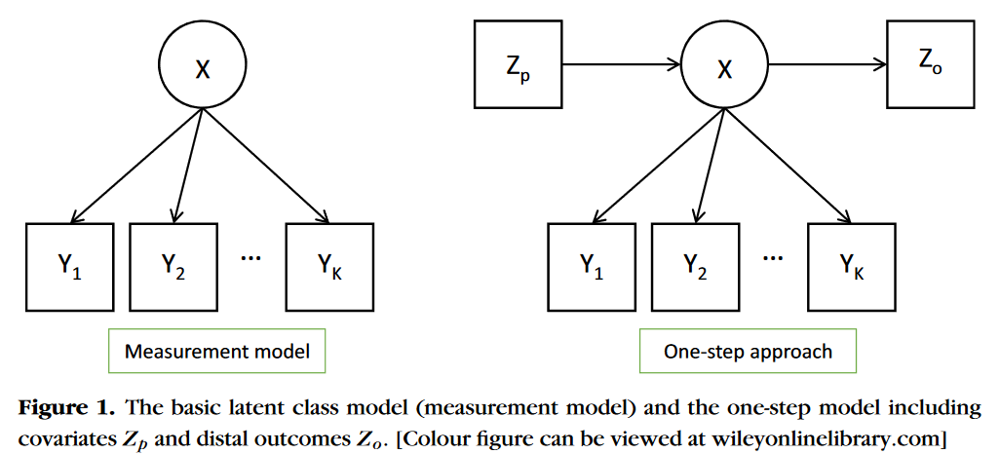{width=95%, height=95%}


# Adding predictors - one-step approach

- A main issue of the one-step approach is that adding the predictor at the same time as we estimate the measurement model. The predictor has an indirect effect on the indicators 
- So, the **meaning** of the latent classes can change between the class enumeration step and after adding predictors


# Adding predictors - two-step approach

- Step 1 consists of fitting the basic LC model (2) with the selected number of latent classes.
- In its second and last step it **fixes the parameters** of the measurement model at their estimated values
- Standard errors need to be adjusted, this makes most difference in situations where the entropy of the measurement model is low


# Adding predictors - two-step approach

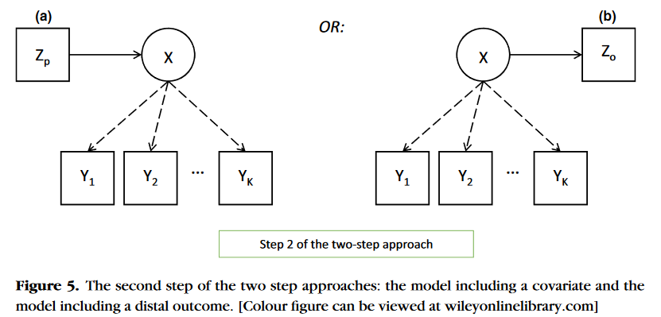{width=95%, height=95%}


# Adding predictors - recommendations

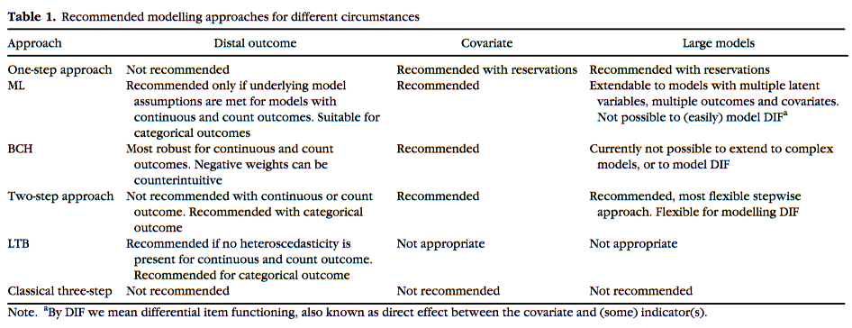{width=95%, height=95%}


# Adding predictors - recommendations

- With covariates
  - It can change the interpretation of the classes in the one-step (be cautious)
  - The two and bias adjusted three step methods are recommended
- With distal outcomes
  - One-step estimation again suffers from a circularity problem. This is because the outcome $Z_o$ that the latent class variable $X$ is supposed to predict in the structural model acts also as another indicator variable in the measurement model, which contributes to the definition of $X$.
  - With categorical outcomes the corrected methods are recommended
  - With continuous outcomes the BCH is the best one


# Adding predictors - recommendations

- For more complex models the two-step approach is recommended. As it controls for missclassification, flexibility of modeling, and also provides faster estimation


# Adding predictors - recommendations

- You might ask, but I cant do the model that I want with the software available, so I can only do the model I want exporting the predicted classes. What can I do then?

- This can happen as many models of interested might not be possible with one of the corrected methods

- If you **must** use the predicted classes (naive three-step). Be **very** rigorous in the evaluation of the classification diagnostics
  - For example, have high entropy, high AvePP, high predicted probabilities in general
  - Make an argument that your model is **as certain as possible** of the predited classes

- This is a more *practical* recommendation, instead of a *methodological* one (prefer a corrected method when possible)

# Adding predictors - `latent`

- In `latent` we have available one and two step regressions
- In these examples we will present the two-step method

# Adding predictors - `latent`

- Step 1: what we did before, the 3 class solution for categorical indicators

```{r}
fit4 <- lca(data = dat, nclasses = 3,
           multinomial = c("contplt", "badge", "sgnptit", "bctprd", 
                           "donprty", "pbldmna", "volunfp","pstplonl") )
```

# Adding predictors - `latent`

- Specify the predictors in `X`: gender and age in this example
- Specify the measurement in `model`

```{r}
fit4_step2 <- lca(data = dat,
                  nclasses = 3,
                  multinomial = c("contplt", "badge", 
                                  "sgnptit", "bctprd", 
                                  "donprty", "pbldmna", 
                                  "volunfp","pstplonl"),
                 X = c("gndr", "agea"),
                 model = fit4)
```

# Adding predictors - `latent`

```{r}
latInspect(fit4_step2, "coefs")
```

# Adding predictors - `latent`

- Estimate corrected standard errors and confidence intervals

```{r}
se_step2 <- se(fit4_step2)
se_step2$table$beta

# Compute 95% confidence intervals for predictor coefficients.
ci_step2 <- ci(fit4_step2, confidence = 0.95)
ci_step2$table$beta
```

Even better, plot the Odds Ratios + confidence intervals in forestplot style:
```{r, eval = FALSE}
x <- plot_coeffs(fit4_step2,
                 what = "OR",        # Odds ratios
                 effects = "coding", # Effects-coding parametrization
                 confidence = 0.95,  # Confidence level
                 xlim = c(0, 3),     # Plot limits for x-axis
                 mfrow = c(2, 2))    # Grid of viewer panel
```

# Adding predictors - `latent`

- Get class prediction probabilities based on each row of data predictors (0 = men, 1 = women)

```{r}
head(predict(fit4_step2))
```


# Adding predictors - `latent`

- Get class predictions for specific combinations of the predictors
- Men and women differences at age 50

```{r}
predict(fit4_step2, 
        new = rbind(c(0,50),
                    c(1,50)))
```


# Adding predictors - `latent`

- Get class predictions for specific combinations of the predictors
- 5 year difference between men and women

```{r}
predict(fit4_step2, 
        new = rbind(c(0,45),
                    c(0,50),
                    c(1,45),
                    c(1,50)))
```

# Control arguments

- `latent` has *good* defaults, but you can change the `control` arguments
- These are the main control arguments ... 

```{r}
control = list(opt     = "lbfgs", # newton
               maxit   = 1000L,   # Maximum number of iterations
               rstarts = 16L,     # Number of random starts
               cores   = 1L,      # Number or parallel runs
               eps     = 1e-05)   # Convergence criteria (gradient norm)
```

You can check the convergence information to assess nonconvergence problems:
```{r, eval=FALSE}
latInspect(fit4_step2, what = "convergence")

fit4_step2 <- lca(data = dat,
                  nclasses = 3,
                  multinomial = c("contplt", "badge", 
                                  "sgnptit", "bctprd", 
                                  "donprty", "pbldmna", 
                                  "volunfp","pstplonl"),
                 X = c("gndr", "agea"),
                 model = fit4,
                 control = control)
```

# Penalties

- `latent` has *good* defaults, and by default it runs penalized estimation
- But it has a *small* penalization by default
- You can adjust penalties for certain parameters by modifying the alpha values:

```{r}
penalty_defaults <- list(
  class = list(alpha = 1), # Penalty for class probabilities
  prob  = list(alpha = 1), # Penalty for item probabilities (multinomial items)
  var   = list(alpha = 1), # Penalty for item variances (gaussian items)
  Sigma = list(alpha = 1)  # Penalty for covariance matrices (gaussian items)
)
```

- Higher alpha values imply higher regularization (i.e., probabilities are pulled away from their 0 and 1 boundaries and variances are pulled away from 0).

```{r, eval=FALSE}
latInspect(fit4, what = "profile")
set.seed(15)
fit4.2 <- lca(data = dat, nclasses = 3,
            multinomial = c("contplt", "badge", "sgnptit", "bctprd", 
                            "donprty", "pbldmna", "volunfp","pstplonl"),
            penalties = list(prob = list(alpha = 10)))
latInspect(fit4.2, what = "profile")
```

# References {.scrollable}

\tiny

- Van Lissa, C. J., Garnier-Villarreal, M., & Anadria, D. (2023). Recommended Practices in Latent Class Analysis Using the Open-Source R-Package tidySEM. Structural Equation Modeling: A Multidisciplinary Journal, 1–9. https://doi.org/10.1080/10705511.2023.2250920
- Bacher, J., & Vermunt, J. (2010). Analyse latenter klassen. In C. Wolf & H. Hennig (Eds.),
- Handbuch der sozialwissenschaftlichen datenanalyse (pp. 553–574). VS Verlag.
- Collins, L. M., & Lanza, S. T. (2010). Latent Class and Latent Transition Analysis: With Applications in the Social, Behavioral, and Health Science. John Wiley & Sons, Inc.
- Masyn, K. E. (2013). Latent Class Analysis and Finite Mixture Modeling. In P. E. Nathan & T. D. Little (Eds.), The Oxford Handbook of Quantitative Methods: Vol. Volume 2: Statistical Analysis (p. 63). Oxford University Press.
- Nylund-Gibson, K., & Choi, A. Y. (2018). Ten frequently asked questions about latent class analysis. Translational Issues in Psychological Science, 4(4), 440–461. https://doi.org/10.1037/tps0000176
- Ruscio, J. and Ruscio, A. (2008). Advancing psychological science through the study of latent structure. In Current directions in psychological science. 17:203-207.
- Spurk, D., Hirschi, A., Wang, M., Valero, D., & Kauffeld, S. (2020). Latent profile analysis: A review and “how to” guide of its application within vocational behavior research. Journal of Vocational Behavior, 120, 103445. https://doi.org/10.1016/j.jvb.2020.103445
- Oberski, D. L., van Kollenburg, G. H., & Vermunt, J. K. (2013). A Monte Carlo evaluation of three methods to detect local dependence in binary data latent class models. Advances in Data Analysis and Classification, 7(3), 267–279. https://doi.org/10.1007/s11634-013-0146-2
- Bakk, Z., & Kuha, J. (2018). Two-Step Estimation of Models Between Latent Classes and External Variables. Psychometrika, 83(4), 871–892. https://doi.org/10.1007/s11336-017-9592-7
- Bakk, Z., & Kuha, J. (2021). Relating latent class membership to external variables: An overview. British Journal of Mathematical and Statistical Psychology, 74(2), 340–362. https://doi.org/10.1111/bmsp.12227

