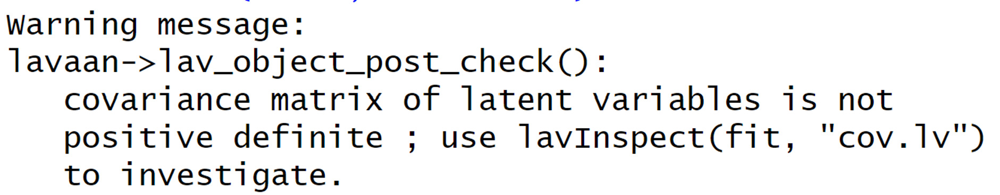
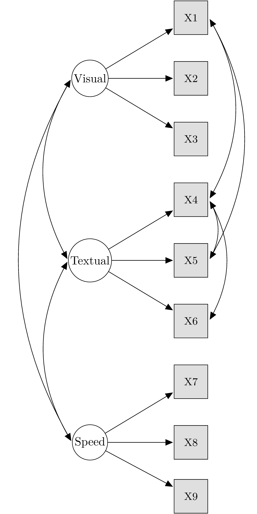
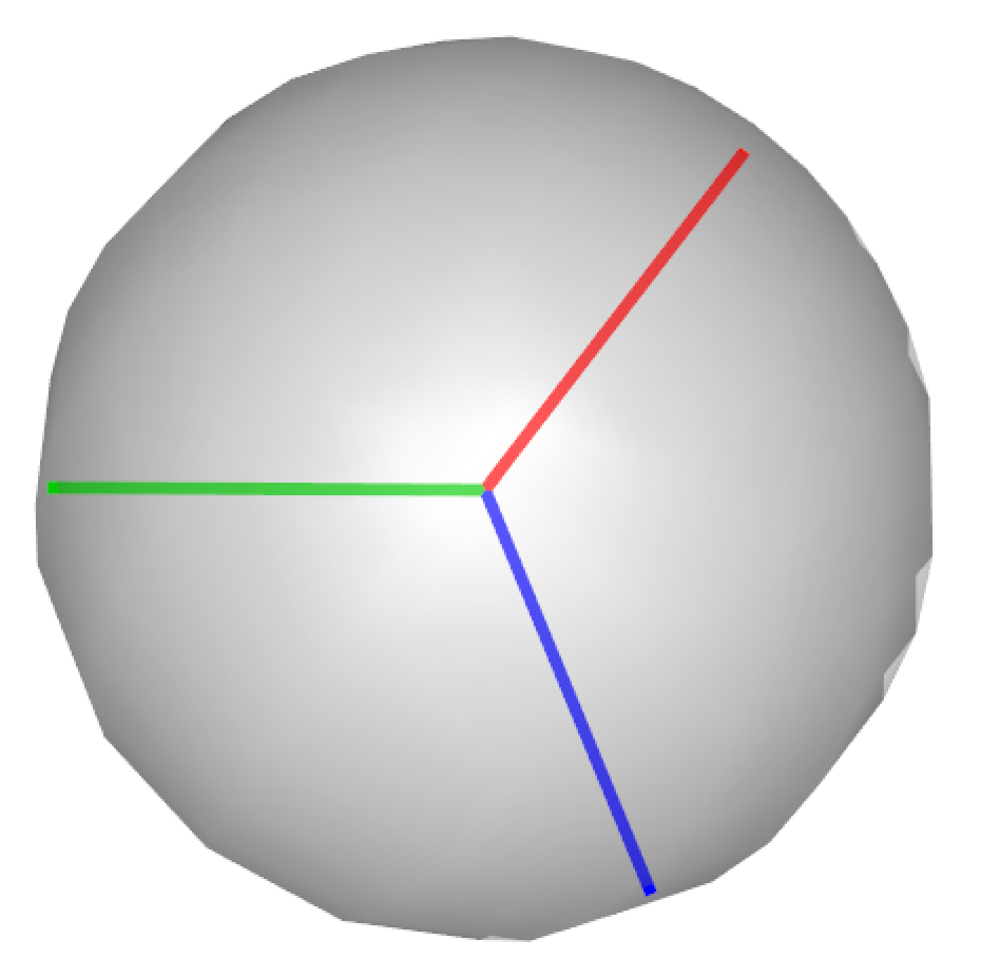
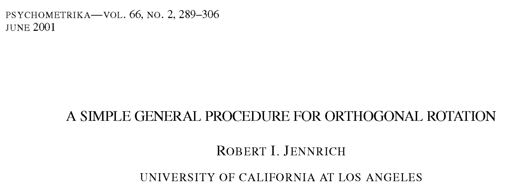
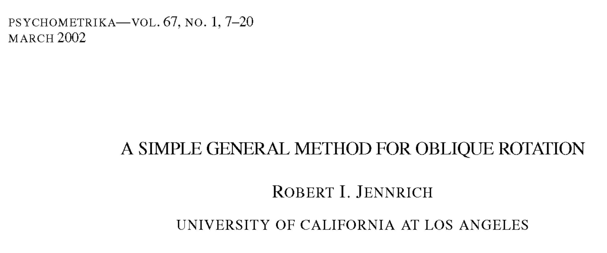
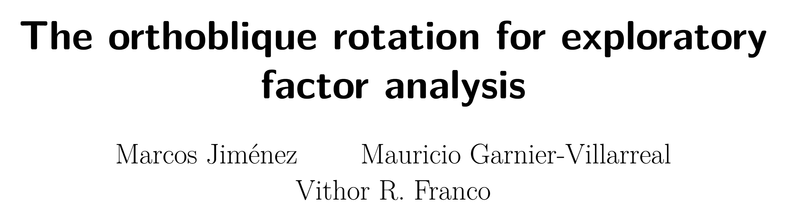

# The latent R package

```{r eval=TRUE, echo=FALSE}
library(latent)
```

::: {.columns}
::: {.column width="60%"}

- Core functions written in C++
- Highly customizable models
- lavaan syntax for Structural Equation Models

{width=300%}

:::
::: {.column width="40%"}
{width=300%}
:::
:::

# Example: Confirmatory Factor Analysis Example

<div style="font-size: 125%;">

::: {.columns}
::: {.column width="70%"}

Model fitting:
```{r eval=FALSE, echo=TRUE}
HS.model <- ' visual  =~ x1 + x2 + x3
              textual =~ x4 + x5 + x6
              speed   =~ x7 + x8 + x9 '
fit <- lcfa(model = HS.model, data = HolzingerSwineford1939)
```

Extract model information:
```{r eval=FALSE, echo=TRUE}
# Get fit indices:
lavaan::fitMeasures(fit)

# Inspect model objects:
lavaan::inspect(fit, what = "est", digits = 3) # Estimates
lavaan::inspect(fit, what = "se", digits = 3)  # Standard errors
```

:::
::: {.column width="30%"}
{width=300%}
:::
:::

</div>

# Problem: Positive-definite constraints

<div style="font-size: 150%;">
In the factor model equation,
$$
S = \Lambda \color{red}{\Psi} \Lambda^\top + \color{red}{\Theta},
$$
Latent correlations $\color{red}{\Psi}$ and covariances $\color{red}{\Theta}$ should be positive-definite but...

</div>

{width=200px}

# Positive-definite constraints (`lavaan` fails)

::: {.columns}
::: {.column width="70%"}

Let's force lavaan to fail for convergence:

```{r, eval=TRUE, echo=TRUE}
library(lavaan)
model <- 'visual  =~ x1 + x2 + x3
          textual =~ x4 + x5 + x6
          speed   =~ x7 + x8 + x9
          x1 ~~ x5
          x1 ~~ x4
          x4 ~~ x5
          x4 ~~ x6'
fit <- cfa(data = HolzingerSwineford1939, model = model, estimator = "ml")
inspect(fit, what = "est")$theta      # Error covariances
det(inspect(fit, what = "est")$theta) # Check the determinant
```

:::
::: {.column width="30%"}
{height=650px fig-align="center"}
:::
:::

# Positive-definite constraints (`latent` converges)

<div style="font-size: 110%;">

::: {.columns}
::: {.column width="30%"}

{height=400px}

:::
::: {.column width="70%"}

```{r, eval=TRUE, echo=TRUE}
fit <- lcfa(data = HolzingerSwineford1939, model = model, 
            estimator = "ml", positive = TRUE)
round(latInspect(fit, what = "est")[[1]]$theta, 3) # Error covariances
det(latInspect(fit, what = "est")[[1]]$theta) # Check the determinant
```

:::
:::

</div>

# Positive-semidefinite latent covariances

<div style="font-size: 110%;">

::: {.columns}
::: {.column width="30%"}

{height=400px}

:::
::: {.column width="45%"}

- Parameterize latent covariances as crossproducts:

$$
\Psi = Y^\top Y \\
\Theta = U^\top U
$$

- Constraint **Y** and **U** to be **orthoblique**:
$$
X \in \mathbb{R}^{p\times p}: X^\top X = \text{sparse matrix}
$$
:::
::: {.column width="25%"}

\phantom{{height=300px}}

:::
:::

</div>

$$
\begin{bmatrix}
\color{red}{0.08} & \color{blue}{1.76} & \color{green}{0.04} \\
\color{red}{-1.95} & \color{blue}{-0.12} & \color{green}{-0.69} \\
\color{red}{-0.67} & \color{blue}{-0.08} & \color{green}{2.02}
\end{bmatrix}^\top \begin{bmatrix}
\color{red}{0.08} & \color{blue}{1.76} & \color{green}{0.04} \\
\color{red}{-1.95} & \color{blue}{-0.12} & \color{green}{-0.69} \\
\color{red}{-0.67} & \color{blue}{-0.08} & \color{green}{2.02}
\end{bmatrix} = \begin{bmatrix}
4.24 & 0.42 & 0.00 \\
0.42 & 3.11 & 0.00 \\
0.00 & 0.00 & 4.56
\end{bmatrix}
$$

# Positive-semidefinite latent correlations

<div style="font-size: 110%;">

::: {.columns}
::: {.column width="30%"}

{height=400px}

:::
::: {.column width="45%"}

- Parameterize latent covariances as crossproducts:

$$
\Psi = Y^\top Y \\
\Theta = U^\top U
$$

- Constraint **Y** and **U** to be **orthoblique**:
$$
X \in \mathbb{R}^{p\times p}: X^\top X = \text{sparse matrix}
$$
:::
::: {.column width="25%"}

{height=300px}

:::
:::

</div>

$$
\begin{bmatrix}
\color{red}{0.04} & \color{blue}{1.00} & \color{green}{0.02} \\
\color{red}{-0.95} & \color{blue}{-0.07} & \color{green}{-0.32} \\
\color{red}{-0.32} & \color{blue}{-0.05} & \color{green}{0.95}
\end{bmatrix}^\top \begin{bmatrix}
\color{red}{0.04} & \color{blue}{1.00} & \color{green}{0.02} \\
\color{red}{-0.95} & \color{blue}{-0.07} & \color{green}{-0.32} \\
\color{red}{-0.32} & \color{blue}{-0.05} & \color{green}{0.95}
\end{bmatrix} = \begin{bmatrix}
1.00 & 0.12 & 0.00 \\
0.12 & 1.00 & 0.00 \\
0.00 & 0.00 & 1.00
\end{bmatrix}
$$

# This is like factor rotation in EFA

::: {.columns}
::: {.column width="60%"}

$$
\begin{aligned}
S
&=
\underbrace{\color{blue}{\Lambda X^{-\top}}}_{\color{blue}{\Lambda^\ast}}
\,
\underbrace{\color{red}{(X^\top X)}}_{\color{red}{\Psi}}
\,
\underbrace{\color{blue}{(\Lambda X^{-\top})^\top}}_{\color{blue}{\Lambda^{\ast\top}}} + \Theta
\\[1.2em]
&=
\Lambda^\ast \Psi \Lambda^{\ast\top} + \Theta.
\end{aligned}
$$

<div style="font-size: 140%;">

::: {.callout-important icon=false title="Type of constraint"}
- **Orthogonal rotation**:  
  $X \in \mathbb{R}^{p\times p}$ such that $X^\top X = I$.

- **Oblique rotation**:  
  $X \in \mathbb{R}^{p\times p}$ such that $X^\top X = \text{dense matrix (with unit diagonal)}$.

- **Orthoblique rotation**:  
  $X \in \mathbb{R}^{p\times p}$ such that $X^\top X = \text{sparse matrix (with unit diagonal)}$.
:::

</div>

:::
::: {.column width="40%"}

\phantom{{height=300px}}

:::
:::

# This is like factor rotation in EFA

::: {.columns}
::: {.column width="60%"}

$$
\begin{aligned}
S
&=
\underbrace{\color{blue}{\Lambda X^{-\top}}}_{\color{blue}{\Lambda^\ast}}
\,
\underbrace{\color{red}{(X^\top X)}}_{\color{red}{\Psi}}
\,
\underbrace{\color{blue}{(\Lambda X^{-\top})^\top}}_{\color{blue}{\Lambda^{\ast\top}}} + \Theta
\\[1.2em]
&=
\Lambda^\ast \Psi \Lambda^{\ast\top} + \Theta.
\end{aligned}
$$

<div style="font-size: 140%;">

::: {.callout-important icon=false title="Type of constraint"}
- **Orthogonal rotation**:  
  $X \in \mathbb{R}^{p\times p}$ such that $X^\top X = I$.

- **Oblique rotation**:  
  $X \in \mathbb{R}^{p\times p}$ such that $X^\top X = \text{dense matrix (with unit diagonal)}$.

- **Orthoblique rotation**:  
  $X \in \mathbb{R}^{p\times p}$ such that $X^\top X = \text{sparse matrix (with unit diagonal)}$.
:::

</div>

:::
::: {.column width="40%"}

{width=100%}

:::
:::

# New factor rotation in EFA

::: {.columns}
::: {.column width="50%"}
{width=300%}
:::
::: {.column width="50%"}
{width=300%}
:::
:::
{width=75% fig-align="center"}

# From positive-semidefinite to positive-definite

<div style="font-size: 110%;">

::: {.columns}
::: {.column width="70%"}

We may maximize the log likelihood subject to a weighted penalty
$$
\operatorname*{argmax}_{\theta}\; \ell(\theta) + w \cdot \mathrm{penalty}
$$
Suppose the penalty only involves $\Psi$.

* The parameterization $\Psi = Y^\top Y$ is an square, so $\det \Psi \geq 0$.

* Notice that $0 \leq \det (D^{-1/2} \Psi D^{-1/2}) \geq 1$, where $D = \mathrm{diag} (\Psi)$.

Therefore, a good penalty term for $\Psi$ becomes
$$
\log\det (D^{-1/2} \Psi D^{-1/2}).
$$

:::
::: {.column width="30%"}
{height=400px fig-align="center"}
:::
:::

</div>

# Summary

<div style="font-size: 140%;">

In the factor model $S = \Lambda \Psi \Lambda^\top + \Theta$, 

(1) the following parameterization will ensure, at least, positive-semidefinite matrices:
$$
\scriptsize \Psi = Y^\top Y \\
\scriptsize \Theta = U^\top U,
$$
where $Y$ and $U$ are **orthoblique** matrices (i.e., $X \in \mathbb{R}^{p\times p}: X^\top X = \text{sparse matrix}$).

(2) Then, adding the $\color{red}{\log \det}$ of the standardized $\Psi$ and $\Theta$ as a penalty to the log likelihood will encourage their positive-definiteness.

</div>

# Cooking new stuff

::: {.columns}
::: {.column width="60%"}

- (Exploratory) Structural Equation Modeling

- Hidden Markov Models

- (Multidimensional) Item Response Theory

Release date? We don't know

Download the **beta version** at https://github.com/Marcosjnez/latent

**Contact:** m.j.jimenezhenriquez@vu.nl

{width=300px style="vertical-align:middle; margin-right:0.5em;"}

:::
::: {.column width="40%"}

{width=1000px style="vertical-align:middle; margin-right:0.5em;"}

:::
:::
